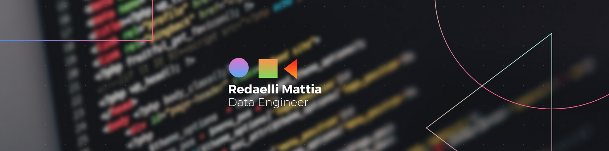

#  Hi, I’m @redaellimattia
My name is Mattia Redaelli and I am an MSc student in Computer Science & Engineering with a focus on Cybersecurity.  
I'm from Italy and currently, I'm studying at the Polytechnic University of Milan.  
Here's something about me
## 🔧 Technologies & Tools

  

  

  

  
## Socials

